# Lecture 4: Reverse
**Mục tiêu:** Một số kỹ năng dịch ngươc ứng dụng.

## Inside the apk
APK (Android application package) là một file chứa các thành phần cần thiết cho việc cài đặt app trên thiết bị android. Giống với window (`.exe`), việc cài đặt thủ công gọi là `side-loading`

Các thành phần có trong file apk
- **META-INF/:** Thư mục này có ở trong file ẠP đã sign bao gồm các danh sách file trong APK và chữ ký xác thực của các file
- **lib/:** Các file của thư viện native (`*.so`)được lưu vào thư mục con của `lib/` như `x86`, `x86_64`
- **res/:** Thư mục này gồm tất cả các resource XML, drawables với các loại khác nhau từ `mdpi`, `hdpi`,...
- **AndroidManifest.xml:** Mô tả tên, phiên bản và nội dung file APK
- **classes.dex:** Bao gồm mã nguồn đã biên dịch được chuyển duưới dạng Dex bytecode
- **resources.arsc:** Một số tài nguyên và định nghĩa được biên dịch và lưu trữ ở đây. Các resource này lưu vào APK mà không cần nén để truy cập nhanh hơn lúc runtime.

APK là một file nén, cụ thể là `zip format-type` dựa trên `JAR file format` với `.apk` là phần mở rộng. Thực hiện `unzip`
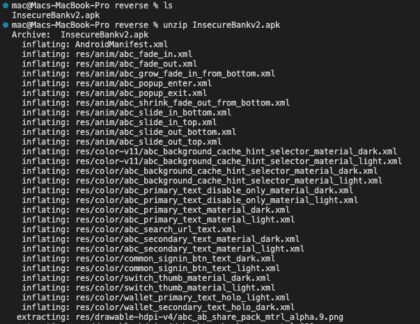
Sau khi unzip xong kiểm tra các file hiện có
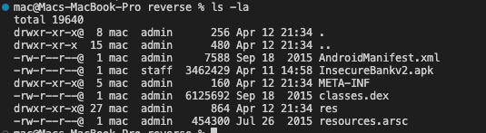
Danh sách các file đã được nhắc đến ở phần trên. Tuy nhiên chưa thể xem được do các file đang ở dạng binary. Do đó cần **thực hiện dịch ngược** nó bằng công cụ [APKTool](https://apktool.org/docs/install). *Công cụ này có thể giúp chúng ta patching sau này.*
```commandline
apktool d InsecureBankv2.apk
```
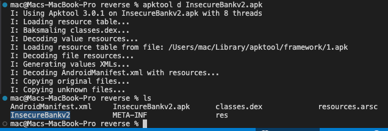
Output sau khi decompile được lưu trong thư mục `InsecureBankv2`. APKTool giúp decompile file `AndroidManifest` về định dạng xml nguyên bản cũng như `resource.arsc` và `classes.dex` file thành một ngôn ngữ gọi là `SMALI`

## Smali
Mọi quy trình làm vừa rồi ở mục *Inside the apk* đều có thể tự động bằng *ByteCode Viewer*

Chúng ta cần hiểu rõ **smali** để hiểu luồng hoạt động của code đang chạy như thế nào và có thể `patching` để thay đổi mã nguồn thực thi. Sau đây là ví dụ về luồng họ động của `smali`.

Trong `Bytecode Viewer` truy cập vào `view -> pane 2 -> Smail/DEX` để hiển thị mã `smali` ở bên cửa sổ thứ 2 của màn hình.
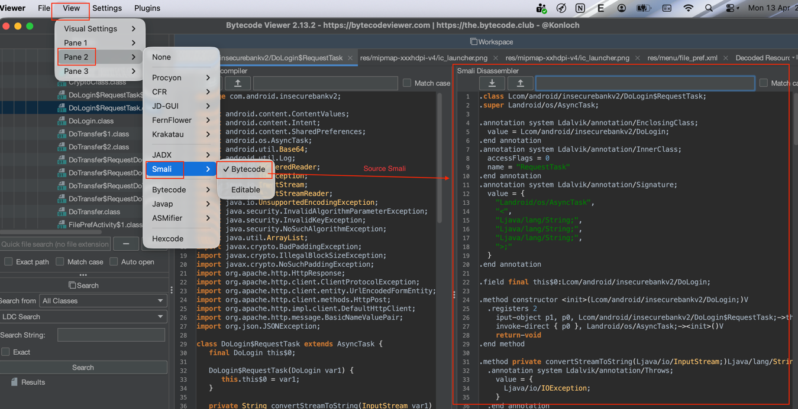
Giờ hãy cùng tôi phân tích đoạn mã bypass Login admin vừa rồi ở phần trên. Đây là đoạn mã gốc chưa được dịch sang `smali`
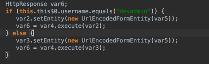
Sau đó ta tìm kiếm chuỗi `devadmin` trong mã `smali` để tìm đến phần logic xử lý.
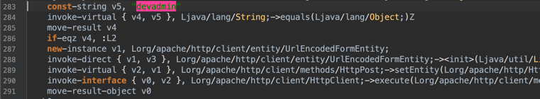
Giải thích một chút mã `smali`:
- Khởi tạo chuỗi `devadmin` lưu vào biến `v5`.
- Dòng 284, so sánh chuỗi nhập vào `v4` với `v5`. Kết quả đúng thì trả về `1` và sai trả về `0`.
- Dòng 285, kết quả so sánh được lưu vào biến `v4`.
- Dòng 286, `if-eqz` nghĩa là `equal zero`, nếu `v4 = 0` thì hàm sẽ được nhảy tới `L2:` và khác `0` thì thực hiện tiếp.
Giờ ta sẽ thực hiện phân tích 2 hàm rẽ nhánh của điều kiện này.
- Với hàm nếu `if-eqz` không thỏa mãn
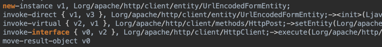
- Với hàm nếu `if-eqz` thỏa mãn
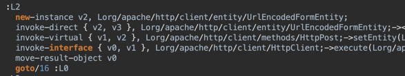
Về cơ bản thì hai hàm không khác nhau là mấy.

Tuy nhiên sẽ có câu hỏi *Tại sao phải đọc mã `smali` trong khi có thể đọc được source code Java?*

## Patching android app
Patching app đơn giản là tác động và làm thay đổi code của chương trình và khiến nó hoạt động theo ý mình. Sử dụng `APKTool` để patching. Trước tiên cần thực hiện decompile apk theo lệnh sau
```commandline
apktool d InsecureBankv2.apk
```
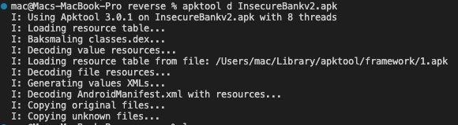
Chúng ta cùng nhau khám phá xem có gì trong đây? Hãy mở thử thư mục `res`, đây là thư mục chứa resource và chúng ta có thể thay đổi chúng nhanh chóng. Truy cập file lưu chữ các `string` của app là `InsecureBankv2/res/values`
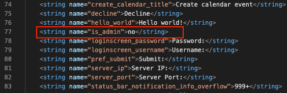
Tại đây tìm thấy một `value` lạ, thử đổi `isAdmin: yes` xem điều gì sẽ xảy ra.

Lúc này cần phải recompile lại thành file apk.
```commandline
apktool b InsecureBankv2
```
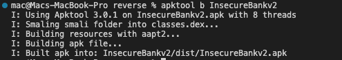
Sau khi được compile thì thường file sẽ được nằm trong thư mục `InsecureBankv2/dist`. Trước khi cài đặt file thì chúng ta cần phải ký lại file nguyên nhân do có một file thay đổi thì trong `META-INF` lưu chữ ký cũ của file gốc, thực hiện ký ta sử dụng tools `keytool` và `jarsigner`.
Thực hiện tạo key bằng `keytool`
```commandline
keytool -genkey -v -keystore my-release-key.keystore -alias alias_name -keyalg RSA -keysize 2048 -validity 10000
```
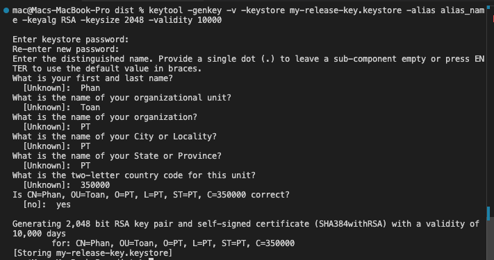
Sau đó thực ký với key vừa rồi bằng `jarsigner`
```commandline
jarsigner -verbose -sigalg SHA1withRSA -digestalg SHA1 -keystore my-release-key.keystore InsecureBankv2.apk alias_name
```
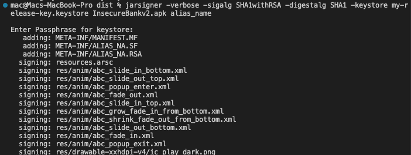
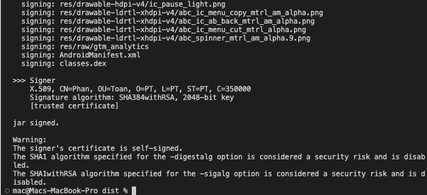

Trước khi cài đặt ứng dụng mới thì ta cần phải gỡ bỏ ứng dụng cũ đi trước! Ngoài ra ta sẽ đổi tên thành `InsecureBankv2_patch` để tránh nhầm lẫn.

Lúc này ta thấy `Create User` được hiển thị, phần này chỉ có khi chúng ta sửa đổi `isAdmin: Yes`. Kết quả cho thấy ta đã `patching app` thành công.

Hiện tại khi truy cập vào app thì chúng đang `Device not root` tuy nhiên hệ thống chúng ta đã `root` mà, hệ thống có vẻ hơi ... nhưng không sao giờ hãy thử bypass ngược lại để chứng minh máy chúng ta đang `root`. Mở `Bytecode viewer` và thả file apk để phân tích. Tìm kiếm chuỗi `Root`
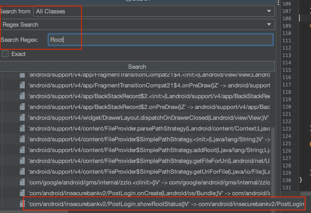
Chúng ta thấy kết quả có hiển thị `showRootStatus` có vẻ rất khả nghi, hãy truy cập và tìm hiểu nó.
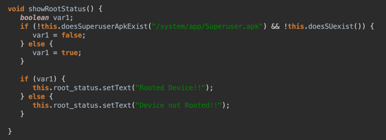
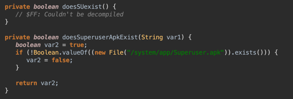
Đoạn mã này kiểm tra xem có tồn tại `/system/app/Superuser.apk` không, nếu có thì phát hiện root còn không thì bỏ qua. Vậy giờ cùng nhau patching đoạn mã này. Hãy mở mã `smali` và cùng nhau phân tích.
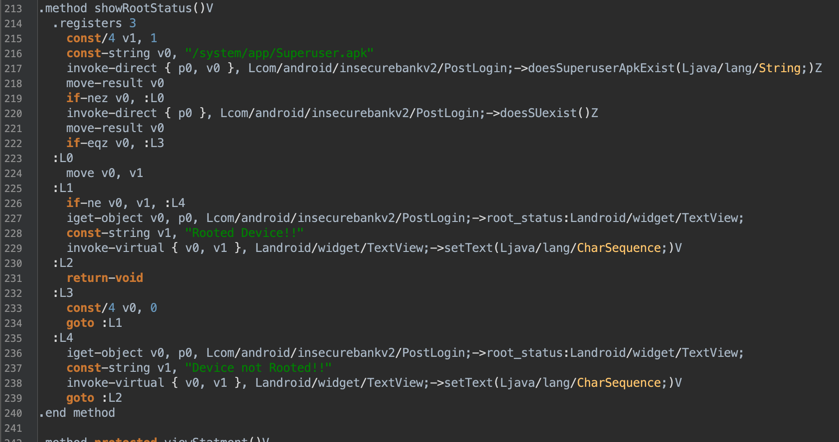
Giải thích sơ lược thì sẽ như thế này, do chúng ta biết rằng output hiện tại là `Device not root` nên có thể điều kiện ở phần so sánh `if(... && ...)` thỏa mãn nên cả hai đề trả về kết quả là `false`. Được rồi bắt đầu dịch mã theo đúng luống hiện tại.
- Dòng 215, 216 là khởi tạo 2 biến với giá trị tương ứng
- Dòng 217, thực hiện tìm kiếm xem tồn tại file có đường dẫn là `/system/app/Superuser.apk` hay không, kết quả không tồn tại và tại dòng 218 kết quả được lưu vào biến `v0 = 0`
- Dòng 219 `if-eqz` tức `equal zero` thì luồng nhảy tới `L3:`, khởi tạo lại biến `v0 = 0` và nhảy tới `L1:`
- Tại `L1:` so sánh `if-ne` tức `not-equal`, kết quả không bằng nhau nên nhảy xuống `L4:` và lúc này  thực hiện in ra kết quả `Device not Rooted!!` sau đó kết thúc phương thức.
Vậy chúng ta thực hiện patching ra sao, rất đơn giản, chúng ta sửa đổi trực tiếp mã nguồn tại đây, ví dụ tại dòng 226 sửa đổi lại thành `if-eq` hoặc sửa dòng 233 thành `const/4 v0, 1`. Nói chung có rất nhiều cách sửa, sau đó ký lại bằng công cụ như phần trên. Ta thử sửa dòng 233 rồi ký nhé!
*(Decompile bằng `apktool` rồi sửa trong VSCode hoặc notepad nhé xD )* Sau đó compile lại và ký!
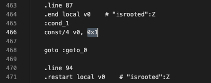
Thực hiện compile
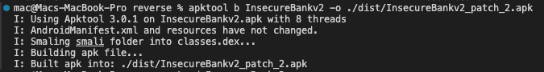
Sau khi ký, thực hiện cài đặt lại!
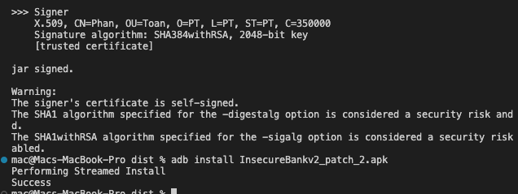


