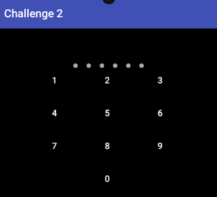
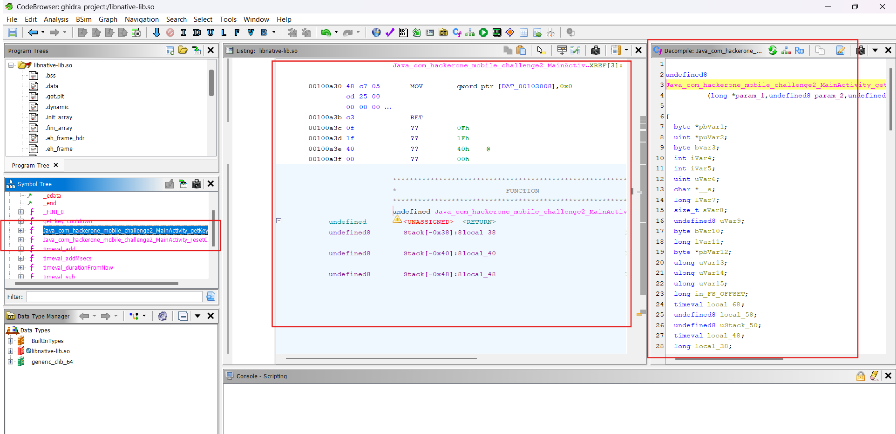
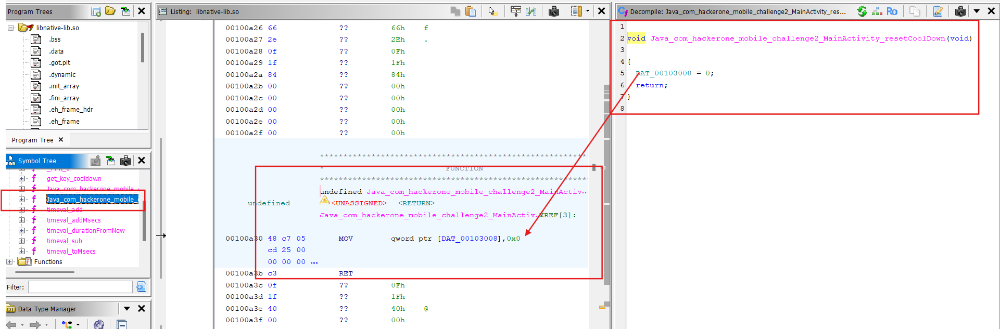
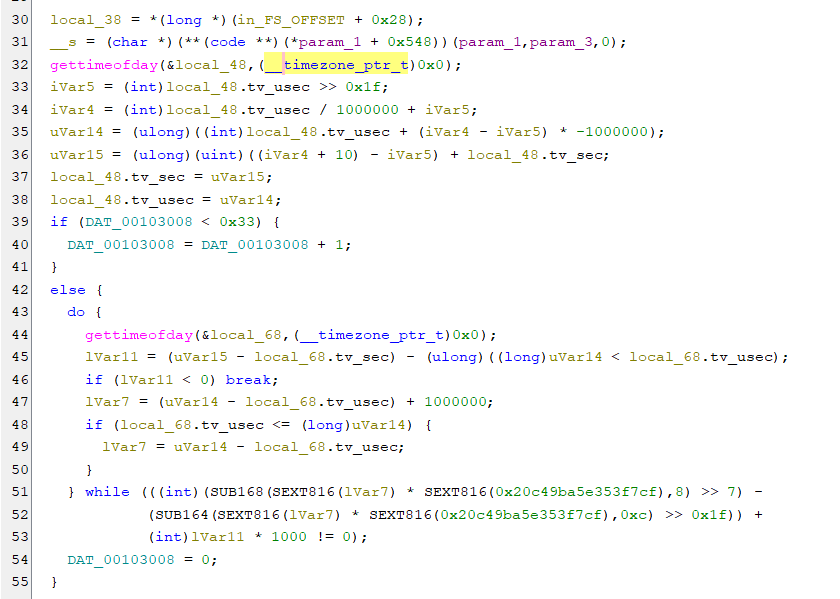
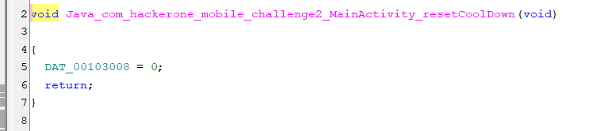
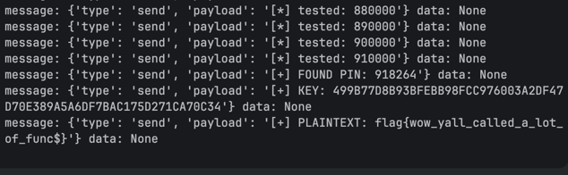
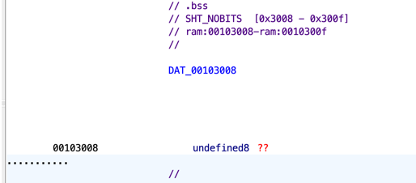
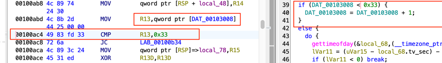
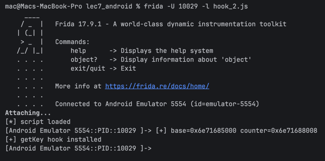
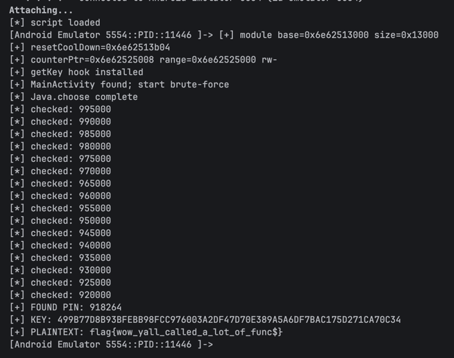

# Lec 7.5: Challenge 2
> Install `challenge2_release.apk` to work on this challenge.
> The original lab comes from `h1-702 2018 CTF`.

[Lab link](https://github.com/tsug0d/AndroidMobilePentest101/blob/master/lab/frida_lab/challenge2_release.apk)

Install the app first and interact with it so we can observe its behavior.

```commandLine
adb install challenge2_realease.apk
```



Enter any PIN value you want, then open `logcat` to see what the app is doing behind the scenes.

```commandline
04-14 22:01:46.012   196   196 I logd    : logdr: UID=0 GID=0 PID=8155 b tail=0 logMask=99 pid=0 start=0ns deadline=0ns
04-14 22:01:48.168   691   691 I wpa_supplicant: wlan0: CTRL-EVENT-BEACON-LOSS
04-14 22:01:53.384  7986  7986 D PinLock : Pin changed, new length 1 with intermediate pin 9
04-14 22:01:53.395   363   498 D AudioFlinger: mixer(0xb400007ba30f8a70) throttle end: throttle time(33)
04-14 22:01:53.438  7986  8006 D EGL_emulation: app_time_stats: avg=35737.02ms min=11.04ms max=357234.59ms count=10
04-14 22:01:53.468  7986  7986 D PinLock : Pin changed, new length 2 with intermediate pin 99
04-14 22:01:53.493   363   498 D AudioFlinger: mixer(0xb400007ba30f8a70) throttle end: throttle time(35)
04-14 22:01:54.067  7986  7986 D PinLock : Pin changed, new length 3 with intermediate pin 999
04-14 22:01:54.454  7986  8006 D EGL_emulation: app_time_stats: avg=11.38ms min=1.72ms max=30.80ms count=60
04-14 22:01:54.534  7986  7986 D PinLock : Pin changed, new length 4 with intermediate pin 9999
04-14 22:01:54.933  7986  7986 D PinLock : Pin changed, new length 5 with intermediate pin 99999
04-14 22:01:55.402  7986  7986 D PinLock : Pin complete: 999999
04-14 22:01:55.402  7986  7986 D TEST    : 00000000000000000000000000000000AC175D27AC175D27AC175D27AC175D27
04-14 22:01:55.402  7986  7986 I org.libsodium.jni.NaCl: librarypath=/system/lib64:/system_ext/lib64
04-14 22:01:55.404  7986  7986 D PROBLEM : Unable to decrypt text
04-14 22:01:55.404  7986  7986 W System.err: java.lang.RuntimeException: Decryption failed. Ciphertext failed verification
04-14 22:01:55.405  7986  7986 W System.err: 	at org.libsodium.jni.crypto.Util.isValid(Util.java:47)
04-14 22:01:55.405  7986  7986 W System.err: 	at org.libsodium.jni.crypto.SecretBox.decrypt(SecretBox.java:56)
04-14 22:01:55.405  7986  7986 W System.err: 	at com.hackerone.mobile.challenge2.MainActivity$1.onComplete(MainActivity.java:42)
04-14 22:01:55.405  7986  7986 W System.err: 	at com.andrognito.pinlockview.PinLockView$1.onNumberClicked(PinLockView.java:56)
04-14 22:01:55.405  7986  7986 W System.err: 	at com.andrognito.pinlockview.PinLockAdapter$NumberViewHolder$1.onClick(PinLockAdapter.java:191)
04-14 22:01:55.405  7986  7986 W System.err: 	at android.view.View.performClick(View.java:7441)
04-14 22:01:55.405  7986  7986 W System.err: 	at android.view.View.performClickInternal(View.java:7418)
04-14 22:01:55.405  7986  7986 W System.err: 	at android.view.View.access$3700(View.java:835)
04-14 22:01:55.405  7986  7986 W System.err: 	at android.view.View$PerformClick.run(View.java:28676)
04-14 22:01:55.405  7986  7986 W System.err: 	at android.os.Handler.handleCallback(Handler.java:938)
04-14 22:01:55.405  7986  7986 W System.err: 	at android.os.Handler.dispatchMessage(Handler.java:99)
04-14 22:01:55.405  7986  7986 W System.err: 	at android.os.Looper.loopOnce(Looper.java:201)
04-14 22:01:55.405  7986  7986 W System.err: 	at android.os.Looper.loop(Looper.java:288)
04-14 22:01:55.405  7986  7986 W System.err: 	at android.app.ActivityThread.main(ActivityThread.java:7839)
04-14 22:01:55.405  7986  7986 W System.err: 	at java.lang.reflect.Method.invoke(Native Method)
04-14 22:01:55.405  7986  7986 W System.err: 	at com.android.internal.os.RuntimeInit$MethodAndArgsCaller.run(RuntimeInit.java:548)
04-14 22:01:55.405  7986  7986 W System.err: 	at com.android.internal.os.ZygoteInit.main(ZygoteInit.java:1003)
04-14 22:01:55.468  7986  8006 D EGL_emulation: app_time_stats: avg=16.59ms min=13.60ms max=19.65ms count=61
04-14 22:01:56.100   691   691 I wpa_supplicant: wlan0: CTRL-EVENT-BEACON-LOSS
```

From `logcat`, the keywords `PinLock`, `TEST`, and `PROBLEM` are enough to guide us toward `MainActivity`. Let us inspect the key logic there.

- `onCreate()`:

```java
public void onCreate(Bundle bundle) {
        super.onCreate(bundle);
        setContentView(R.layout.activity_main);
        this.cipherText = new Hex().decode("9646D13EC8F8617D1CEA1CF4334940824C700ADF6A7A3236163CA2C9604B9BE4BDE770AD698C02070F571A0B612BBD3572D81F99");
        this.mPinLockView = (PinLockView) findViewById(R.id.pin_lock_view);
        this.mPinLockView.setPinLockListener(this.mPinLockListener);
        this.mIndicatorDots = (IndicatorDots) findViewById(R.id.indicator_dots);
        this.mPinLockView.attachIndicatorDots(this.mIndicatorDots);
    }
```

This method initializes the required variables. The most important detail is that `cipherText` is hardcoded inside the app.

- `onPinChange()` is only used to update the PIN entry state.
- `onComplete()` contains the core flow: build a key from the user PIN, then try to decrypt the ciphertext.

```java
public void onComplete(String str) {
            Log.d(MainActivity.this.TAG, "Pin complete: " + str);
            byte[] key = MainActivity.this.getKey(str);
            Log.d("TEST", MainActivity.bytesToHex(key));
            try {
                Log.d("DECRYPTED", new String(new SecretBox(key).decrypt("aabbccddeeffgghhaabbccdd".getBytes(), MainActivity.this.cipherText), StandardCharsets.UTF_8));
            } catch (RuntimeException e) {
                Log.d("PROBLEM", "Unable to decrypt text");
                e.printStackTrace();
            }
        }
```

At this point, we already know the following inputs:

```text
cipherText='9646D13EC8F8617D1CEA1CF4334940824C700ADF6A7A3236163CA2C9604B9BE4BDE770AD698C02070F571A0B612BBD3572D81F99'
iv='aabbccddeeffgghhaabbccdd'
Pin='user fill 6-digits'
```

Based on `logcat`, every wrong PIN still reaches `decrypt()`. When the PIN is incorrect, the app immediately throws an exception and prints a stack trace:

```commandline
04-14 22:01:55.404  7986  7986 W System.err: java.lang.RuntimeException: Decryption failed. Ciphertext failed verification
04-14 22:01:55.405  7986  7986 W System.err: 	at org.libsodium.jni.crypto.Util.isValid(Util.java:47)
04-14 22:01:55.405  7986  7986 W System.err: 	at org.libsodium.jni.crypto.SecretBox.decrypt(SecretBox.java:56)
04-14 22:01:55.405  7986  7986 W System.err: 	at com.hackerone.mobile.challenge2.MainActivity$1.onComplete(MainActivity.java:42)
04-14 22:01:55.405  7986  7986 W System.err: 	at com.andrognito.pinlockview.PinLockView$1.onNumberClicked(PinLockView.java:56)
...
```

So the first obvious idea is brute-force against the 6-digit PIN. We could ask AI to write the script right away, but since this is a `zero to hero` exercise, it is more useful to understand the underlying logic first.

If we keep reading the source, we find two native methods:

```java
    import org.libsodium.jni.crypto.SecretBox;
    import org.libsodium.jni.encoders.Hex;

    public native byte[] getKey(String str);

    public native void resetCoolDown();

    static {
        System.loadLibrary("native-lib");
        hexArray = "0123456789ABCDEF".toCharArray();
    }
```

This shows that `getKey()` and `resetCoolDown()` are implemented inside `native-lib`. In the current flow, `getKey()` is called directly from `onComplete()`, while `resetCoolDown()` is not used by the app itself.

> To identify the device ABI:
> `adb shell getprop ro.product.cpu.abi`
>
> Example: `x86_64`

Then open the matching native library, for example `lib/x86_64/libnative-lib.so`.

Inspect `Java_com_hackerone_mobile_challenge2_MainActivity_getKey` in Ghidra:



This is `Java_com_hackerone_mobile_challenge2_MainActivity_resetCoolDown`:



In `resetCoolDown`, we can already see `DAT_00103008 = 0;`, which strongly suggests a counter reset. So the next step is to check whether `DAT_00103008` also appears inside `getKey()`.



This is the block where `DAT_00103008` is used. The condition `DAT_00103008 < 0x33` means the counter is allowed to increase until it reaches `51`. Once it crosses that threshold, execution drops into the `else` branch, sleeps for roughly `10` seconds, and only then resets the counter back to `0`.

The rest of `getKey()` is used to derive the key from the user-supplied PIN. So the high-level conclusion is:

- `getKey()` derives the key and also enforces anti brute-force.
- `resetCoolDown()` lets us clear that counter manually.

Looking back at `resetCoolDown()`:



The bypass path becomes straightforward: brute-force the PIN, and whenever the counter is close to the limit, call `resetCoolDown()` so the anti brute-force logic never slows us down.

Before writing the script, here is the full list of primitives we already have:

- `SecretBox()` for decryption attempts
- `getKey()` to derive a key from the user PIN
- `resetCoolDown()` to reset the counter
- `cipherText`
- `iv`

And here is the Frida script:

```javascript
setTimeout(
    function (){
        function rpad(width, string, pad){
            return (width <= string.length) ? string : rpad(width,pad+string,pad);
        }
        function getPin(pin){
            return rpad(6,pin,'0');
        }
        Java.perform(
            function() {
                const SecretBox = Java.use('org.libsodium.jni.crypto.SecretBox');
                const Hex = Java.use('org.libsodium.jni.encoders.Hex');
                const JString = Java.use('java.lang.String');
                const MainActivity = Java.use('com.hackerone.mobile.challenge2.MainActivity');
                const cipher = '9646D13EC8F8617D1CEA1CF4334940824C700ADF6A7A3236163CA2C9604B9BE4BDE770AD698C02070F571A0B612BBD3572D81F99';
                const iv = 'aabbccddeeffgghhaabbccdd';
                const BATCH_SIZE = 200;
                const PAUSE_MS = 1;
                const LOG_EVERY = 1000;

                Java.choose('com.hackerone.mobile.challenge2.MainActivity',{
                    onMatch : function(instance){
                        console.log("Found Instance");

                        let counter = 0;
                        let i = 999999;
                        let found = false;
                        const cipherText = Hex.$new().decode(cipher);
                        const nonce = JString.$new(iv).getBytes();

                        function step(){
                            if(found || i < 0){
                                return;
                            }

                            const stop = Math.max(i - BATCH_SIZE, -1);
                            for(; i > stop; i--){
                                const pin = getPin(i.toString());
                                try{
                                    const key = instance.getKey(pin);
                                    counter++;
                                    if(counter >= 51){
                                        counter = 0;
                                        instance.resetCoolDown();
                                    }

                                    let box = null;
                                    try{
                                        box = SecretBox.$new(key);
                                        box.decrypt(nonce,cipherText);
                                        console.log("Found Pin: " + pin + " Hex: " + MainActivity.bytesToHex(key));
                                        found = true;
                                        break;
                                    }catch(err){
                                        // wrong pin
                                    }finally{
                                        if(box !== null){
                                            try{
                                                box.$dispose();
                                            }catch(err){
                                                // nothing
                                            }
                                        }
                                    }
                                }catch(err){
                                    // nothing
                                }

                                if(!found && i % LOG_EVERY === 0){
                                    console.log("Checked down to PIN: " + getPin(i.toString()));
                                }
                            }

                            if(!found && i >= 0){
                                setTimeout(step, PAUSE_MS);
                            }
                        }

                        step();
                    },
                    onComplete : function(){
                        console.log('End!');
                    }
                })

            }
        );
    },0
);
```

Observed output:

```commandLine
Checked down to PIN: 923000
Checked down to PIN: 922000
Checked down to PIN: 921000
Checked down to PIN: 920000
Checked down to PIN: 919000
Found Pin: 918264 Hex: 499B77D8B93BFEBB98FCC976003A2DF47D70E389A5A6DF7BAC175D271CA70C34
```

Enter the recovered PIN and verify the result in `logcat`:



```commandline
04-14 22:50:11.268  8359  8359 D PinLock : Pin complete: 918264
04-14 22:50:11.268  8359  8359 D TEST    : 499B77D8B93BFEBB98FCC976003A2DF47D70E389A5A6DF7BAC175D271CA70C34
04-14 22:50:11.269  8359  8359 D DECRYPTED: flag{wow_yall_called_a_lot_of_func$}
```

*Recovered flag: `flag{wow_yall_called_a_lot_of_func$}`*

## Advanced Exploit (Without Calling `resetCoolDown()`)
As analyzed above, `DAT_00103008` acts as a counter, and it is a global variable in `.bss`. That means it lives for the full app process lifetime and does not reset after each `getKey()` call. So on each call, the previous value is still there and keeps increasing.

The idea is to use Frida to hook into the native library, then reset `DAT_00103008 = 0` before key generation.

From Ghidra, we can see the image base has `offset = 0x00100000`. Checking `DAT_00103008` in Ghidra:

At address `00103008`, we can calculate the counter offset relative to the image base:
```text
COUNTER_OFF = 0x00103008 - 0x00100000 = 0x3008
```
Now we know where the counter is located, so in script form it looks like this:
```javascript
const base = Module.findBaseAddress("libnative-lib.so");
const counterPtr = base.add(0x3008);
```
We should write to the counter before the comparison runs. Looking at the code:

Important note: write with the correct variable size (`qword`), so use `writeU64(0)`, and do it at the correct timing, ideally in `onEnter` of `getKey()`, so every call resets before `CMP ... 0x33`.

Counter bypass source code:
```javascript
'use strict';

const LIB = 'libnative-lib.so';
const IMAGE_BASE = 0x00100000;
const DAT_COUNTER = 0x00103008;
const COUNTER_OFF = DAT_COUNTER - IMAGE_BASE; // 0x3008

console.log('[*] script loaded');

Java.perform(function () {
  const MainActivity = Java.use('com.hackerone.mobile.challenge2.MainActivity');
  const getKeyOv = MainActivity.getKey.overload('java.lang.String');

  let counterPtr = null;
  let hooked = false;

  const t = setInterval(function () {
    try {
      const mod = Process.findModuleByName(LIB);
      if (!mod) {
        console.log('[*] waiting for ' + LIB + ' ...');
        return;
      }

      counterPtr = mod.base.add(COUNTER_OFF);
      console.log('[+] base=' + mod.base + ' counter=' + counterPtr);

      if (!hooked) {
        hooked = true;
        getKeyOv.implementation = function (pin) {
          counterPtr.writeU64(0);
          return getKeyOv.call(this, pin);
        };
        console.log('[+] getKey hook installed');
      }

      clearInterval(t);
    } catch (e) {
      console.log('[-] error: ' + e + '\n' + (e.stack || ''));
    }
  }, 500);
});
```
Result after running:

The output shows `base=0x6e71685000` and `counter=0x6e71688008`, proving the counter bypass works.

Based on that idea, here is the full exploit script:
```javascript
'use strict';

const LIB_NAME = 'libnative-lib.so';
const ACTIVITY = 'com.hackerone.mobile.challenge2.MainActivity';

const CIPHER_HEX = '9646D13EC8F8617D1CEA1CF4334940824C700ADF6A7A3236163CA2C9604B9BE4BDE770AD698C02070F571A0B612BBD3572D81F99';
const NONCE_ASCII = 'aabbccddeeffgghhaabbccdd';

const PIN_START = 999999;
const PIN_END = 0;
const BATCH_SIZE = 400;
const PAUSE_MS = 1;
const LOG_EVERY = 5000;

function zpad6(n) {
  return ('000000' + n).slice(-6);
}

function findExport(moduleName, symbolName) {
  const mod = Process.findModuleByName(moduleName);
  if (!mod) return null;
  const exp = mod.enumerateExports().find(e => e.name === symbolName);
  return exp ? exp.address : null;
}

function getRange(addr) {
  try {
    return Process.findRangeByAddress(addr);
  } catch (_) {
    try {
      return Process.getRangeByAddress(addr);
    } catch (_) {
      return null;
    }
  }
}

function resolveCounterPtrFromReset(resetPtr) {
  const first = Instruction.parse(resetPtr);
  const second = Instruction.parse(first.next);

  // arm64:
  // adrp xN, #PAGE
  // str  xzr, [xN, #disp]   (or wzr)
  if (first.mnemonic === 'adrp' && second.mnemonic === 'str') {
    const o1 = first.operands;
    const o2 = second.operands;
    if (
      o1.length >= 2 &&
      o2.length >= 2 &&
      o1[0].type === 'reg' &&
      o1[1].type === 'imm' &&
      o2[0].type === 'reg' &&
      o2[1].type === 'mem' &&
      (o2[0].value === 'xzr' || o2[0].value === 'wzr') &&
      o2[1].value.base === o1[0].value
    ) {
      return ptr(o1[1].value).add(ptr(o2[1].value.disp));
    }
  }

  // x86_64 fallback:
  // mov qword ptr [rip + disp], 0
  let p = resetPtr;
  for (let i = 0; i < 10; i++) {
    const ins = Instruction.parse(p);
    if (ins.mnemonic === 'mov' && ins.operands.length >= 2) {
      const a = ins.operands[0];
      const b = ins.operands[1];
      if (a.type === 'mem' && b.type === 'imm' && a.value.base === 'rip' && b.value === 0) {
        return ins.next.add(a.value.disp);
      }
    }
    p = ins.next;
  }

  return null;
}

console.log('[*] script loaded');

let started = false;
const boot = setInterval(function () {
  if (started) return;
  try {
    const mod = Process.findModuleByName(LIB_NAME);
    const resetPtr = mod ? findExport(LIB_NAME, 'Java_com_hackerone_mobile_challenge2_MainActivity_resetCoolDown') : null;
    if (!mod || !resetPtr) return;

    const counterPtr = resolveCounterPtrFromReset(resetPtr);
    if (!counterPtr) {
      console.log('[-] failed to resolve counter pointer from resetCoolDown');
      clearInterval(boot);
      return;
    }

    const range = getRange(counterPtr);
    console.log('[+] module base=' + mod.base + ' size=0x' + mod.size.toString(16));
    console.log('[+] resetCoolDown=' + resetPtr);
    console.log('[+] counterPtr=' + counterPtr + ' range=' + (range ? (range.base + ' ' + range.protection) : 'null'));

    if (!range) {
      console.log('[-] counter pointer is unmapped');
      clearInterval(boot);
      return;
    }
    if (range.protection.indexOf('w') === -1) {
      try {
        Memory.protect(range.base, range.size, 'rw-');
      } catch (_) {}
    }

    started = true;
    clearInterval(boot);

    Java.perform(function () {
      const MainActivity = Java.use(ACTIVITY);
      const SecretBox = Java.use('org.libsodium.jni.crypto.SecretBox');
      const Hex = Java.use('org.libsodium.jni.encoders.Hex');
      const JString = Java.use('java.lang.String');

      const getKeyOv = MainActivity.getKey.overload('java.lang.String');
      getKeyOv.implementation = function (pin) {
        try {
          counterPtr.writeU64(0);
        } catch (e) {
          console.log('[-] write counter failed: ' + e);
        }
        return getKeyOv.call(this, pin);
      };
      console.log('[+] getKey hook installed');

      const cipherBytes = Hex.$new().decode(CIPHER_HEX);
      const nonceBytes = JString.$new(NONCE_ASCII).getBytes();

      Java.choose(ACTIVITY, {
        onMatch: function (instance) {
          const act = Java.retain(instance);
          console.log('[+] MainActivity found; start brute-force');

          let i = PIN_START;
          let found = false;

          function step() {
            if (found || i < PIN_END) {
              if (!found) console.log('[-] not found in range');
              return;
            }

            const stop = Math.max(i - BATCH_SIZE, PIN_END - 1);
            for (; i > stop; i--) {
              const pin = zpad6(i);
              try {
                const key = act.getKey(pin);
                const plainBytes = SecretBox.$new(key).decrypt(nonceBytes, cipherBytes);
                const plain = JString.$new(plainBytes).toString();

                console.log('[+] FOUND PIN: ' + pin);
                console.log('[+] KEY: ' + MainActivity.bytesToHex(key));
                console.log('[+] PLAINTEXT: ' + plain);
                found = true;
                break;
              } catch (_) {
                // wrong pin
              }

              if (!found && i % LOG_EVERY === 0) {
                console.log('[*] checked: ' + zpad6(i));
              }
            }

            if (!found) setTimeout(step, PAUSE_MS);
          }

          setTimeout(step, 0);
        },
        onComplete: function () {
          console.log('[*] Java.choose complete');
        }
      });
    });
  } catch (e) {
    console.log('[-] fatal: ' + e + '\n' + (e.stack || ''));
    clearInterval(boot);
  }
}, 200);
```
Final result:

