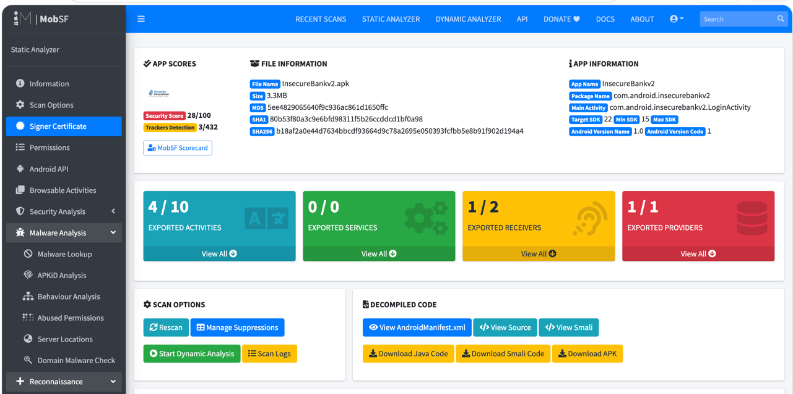
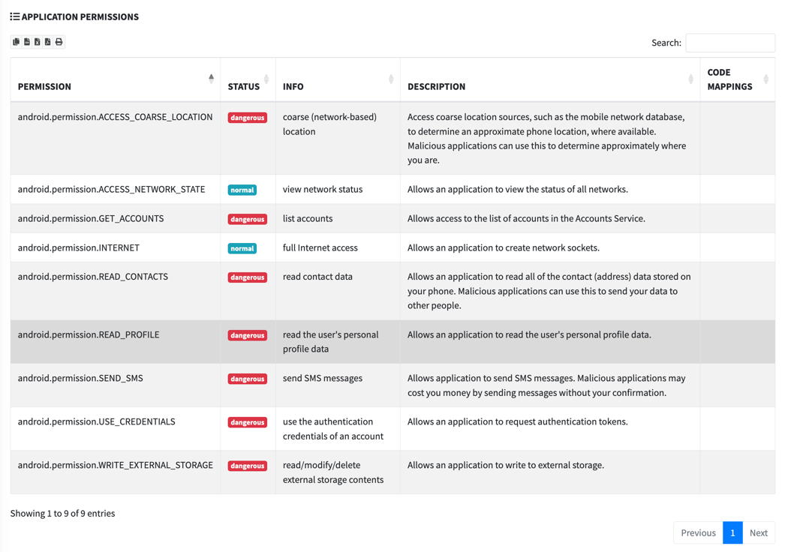
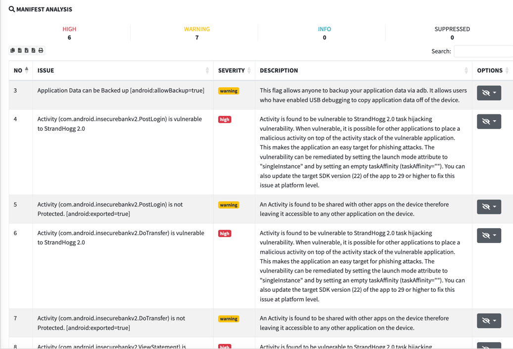
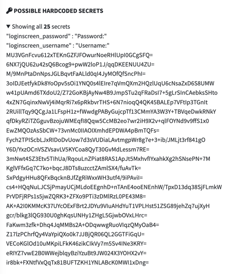
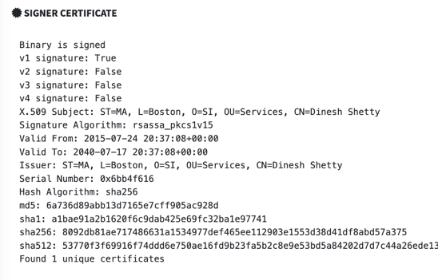
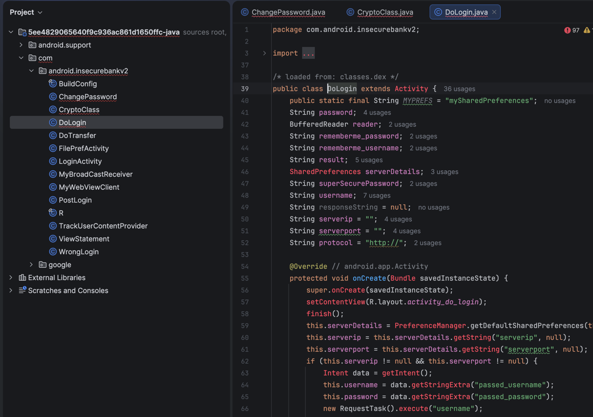
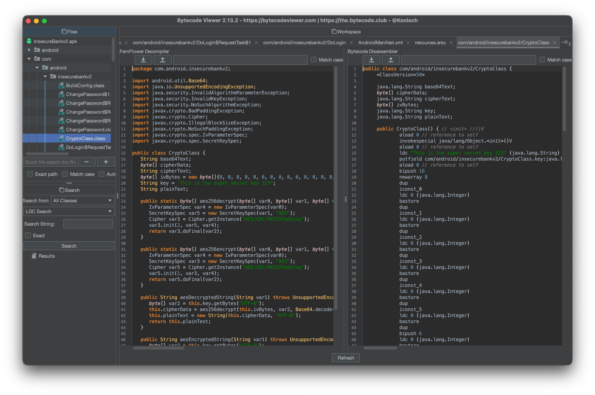
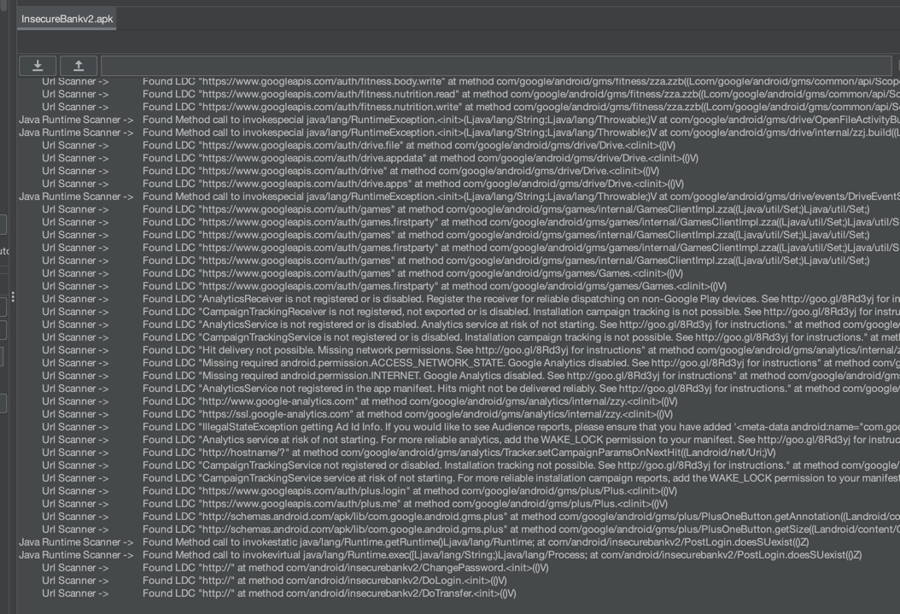
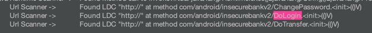
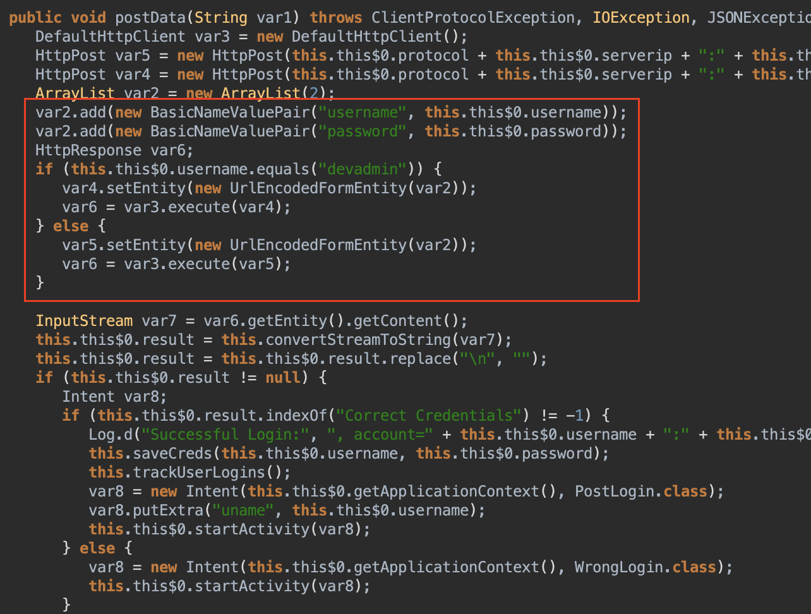

# Lecture 3: Phân tích tĩnh
**Mục tiêu:** Hiểu được cần làm gì trong quá trình phân tích tĩnh

*Phân tích tĩnh là quá trình rà soát một file apk rồi kiểm tra code, config có bị lỗ hổng không, ngoài ra kết hợp làm thủ công thì cần sử dụng thêm một số công cụ để được kết quả chính xác hơn*

**MobSF** là công cụ kiểm tra ứng dụng di động (Android/IOS/Window) tự động, tất cả trong một, có khả năng phân tích tĩnh, phân tích động, phân tích phần mềm độc hại và kiểm tra api web.


Yêu cầu các công cụ cần được tải
- Python 3.6+
- Oracle JDK 1.7 or above
- Người dùng MacOS cần cài Command-line tools
- iOS IPA Analysis chỉ hoạt động trên Mac và Linux
- Phân tích tĩnh Windowns App cần Windown Host hoặc Windowns VM cho Mac/Linux. For Windown Static Analysis.

Hướng dẫn cài đặt (for MacOS)
```commandline
git clone https://github.com/MobSF/Mobile-Security-Framework-MobSF.git

cd Mobile-Security-Framework-MobSF

brew install python@3.12
/opt/homebrew/bin/python3.12 -m venv .venv
source .venv/bin/activate

python --version   # phải là 3.12.x (hoặc 3.13.x)

chmod +x setup.sh run.sh
./setup.sh
./run.sh 127.0.0.1:8000
```
Thực hiện đăng nhập bằng tài khoản `mobsf/modsf`. Sau đó kéo thả file `insecureBankv2.apk` cho MobSF phân tích. Kết quả nhận được cho thấy các thông tin lỗ hổng như
- Kết quả tổng quan phân tích tĩnh

- Kiểm tra các cấu hình phân quyền

- Kiểm tra cấu hình trong file Maniest

- Ngoài ra còn các thông tin khác giúp Pentester đánh giá bảo mật ứng dụng



- Tải mã nguồn java sau khi decompile


Kiểm tra bằng thủ công - Manual Testing

Một trong những bước quan trọng nhất của phân tích tĩnh là kiểm tra code. Để làm việc này, chúng ta sử dụng `ByteCode Viewer`, một tool dùng xem code trong file apk rất ổn. Tải [Bytecode-Viewer-x.x.x.jar](https://github.com/Konloch/bytecode-viewer/releases)

- Thực hiện kéo thả file `insecureBankv2.apk` vào `Bytecode Viewer` và sẽ trả về mã nguồn sau khi decompile cho chúng ta.

- Sử dụng Malicious Code Scanner plugin để scan những đoạn code nguy hiểm

Kết quả cho ra những vector có thể tồn tại lỗ hổng (mang tính chất tham khảo). Ví dụ trong quá trình đọc log thấy có thể tồn tại lỗ hổng tại phương thức trong `com/android/insecurebankv2/DoLogin` 
Dò mã nguồn tại `DoLogin` ta thấy

Nếu đăng nhập với nick `devadmin` thì tự động login được, không cần quan tâm password

Trong quá trình phân tích tĩnh chúng ta cần kiểm tra các cơ chế khác nữa như là
- `anti-root`
- `anti-vm`
- `cert-pinning`
- ...
- Kiểm tra xem key,password có tồn tại trong mã code hay thư mục nào không?
- Kiểm tra xem các thông tin nhạy cảm (credit, card, pass) có được lưu trong database không?
- ...

Kiểm tra thông tin mã hóa cơ sở dữ liệu
- Sử dụng chương trình đăng nhập vào hệ thống để lưu thông tin *(dinesh/Dinesh@123$ or jack/jack@123$)*
- Thực hiện từ máy thật đến máy ảo, truy cập shell sao đó truy cập đến thư mục `/data/data/<app_name>/databases`

Không lưu trữ thông tin nhạy cảm cảm -> An toàn

Kiểm tra lưu thông tin nhạy cảm dưới dạng plain-text
- Sử dụng chương trình
- Sử dụng `adb shell` và đi đên thư mục `/data/data/<app_name>`
- Kiểm tra thông tin nhạy cảm có bị lưu lại không `device`,`uid`, `imei`, `deviceSerialNumber`, `devicePrint`, `XDSN`, `phone`, `mdn`, `IMSI`, `uuid`
- Command
```commandline
grep -r 'string-to-find' $(find)
```

Không có thông tin -> An toàn

Lưu trữ Cookie không an toàn
- Nếu cookie được lưu trữ và không hết hạn. Kẻ tấn công có thể lợi dụng để giả mạo người dùng
- Kiểm tra các thư mục xem có lưu cookie nào không, nếu có thì sử dụng cookie đó để truy cập vào hệ thống xem có chứng thực không.
-> Trong app `InsecureBankv2`, không có cookie nào được tìm thấy -> An toàn

File Backup không được mã hóa
- Kiểm tra các chức năng của hệ thống,hệ thống cho phép backup dữ liệu

- Đăng nhập với quyền người dùng sau đó gõ lệnh sau để backup
```commandline
adb backup -apk -shared com.android.insecurebankv2
```


File backup đã được tạo và do file không được mã hóa khi backup hãy mở file backup lên và kiểm tra mã nguồn. 
- Chuyển đổi file backup qua định dạng đọc được bằng command sau
```commandline
cat backup.ab | (dd bs=24 count=0 skip=1; cat) | zlib-flate -uncompress > backup_compressed.tar
```
Sau đó dùng lệnh sau để giải nén đọc file `tar`
```commandline
tar -zxvf backup_compressed.tar
```

Thực hiện dò soát các thông tin trong file backup

Cho thấy lộ lọt thông tin người dùng đăng nhập hệ thống, IP:Port server

Kiểm tra thông tin nhạy cảm trong log hệ thống
- Tại máy host nhập lệnh `adb logcat`
- Thử đăng nhập và kiểm tra log

-> Lộ lọt thông tin người dùng đăng nhập `username:password`

Kiểm tra mã hóa yếu
Chúng ta thu thập thông tin trong file `mySharedPreferences.xml` có trường mật khẩu được mã hóa.

Dò soát mã nguồn ta thấy có `CryptoClass.class` chứa thông tin mã hóa của hệ thống.

Hệ thống sử dụng mã hóa yếu với `iv` cố định. Thực hiện giải mã mật khẩu `vD7LZlJHJzXn7Vg6FN0JMQ==`
```python
#!/usr/bin/env python3
import base64
import subprocess
import sys

key_hex = b"This is the super secret key 123".hex()
iv_hex = "00" * 16
cipher_b64 = sys.argv[1] if len(sys.argv) > 1 else "vD7LZlJHJzXn7Vg6FN0JMQ=="
cipher = base64.b64decode(cipher_b64)

p = subprocess.run(
    ["openssl", "enc", "-d", "-aes-256-cbc", "-K", key_hex, "-iv", iv_hex],
    input=cipher,
    capture_output=True,
)
if p.returncode != 0:
    raise SystemExit(p.stderr.decode("utf-8", errors="replace").strip())

print(p.stdout.decode("utf-8"), end="")
```
Kết quả ra: `1`


Activity Hijacking
- Trong file `AndroidManiest.xml`, nếu các activity được set về `true`, người dùng có thể hijacking nó và chạy nó.

- Trong hình ảnh, activity `com.android.insecurebankv2.PostLogin` được set về `true`
- Thực hiện `adb shell`
- Lệnh *Call activity manager (am)* là lệnh gọi các lệnh các hệ thống, ví dụ chạy activity, dừng một tiến trình, sửa đổi các thuộc tính,...
- Thực hiện gọi activity `PostLogin`, gõ lệnh
```commandline
am start -n com.android.insecurebankv2/.PostLogin
```

Kết quả app tự động login theo mà không cần đăng nhập.
